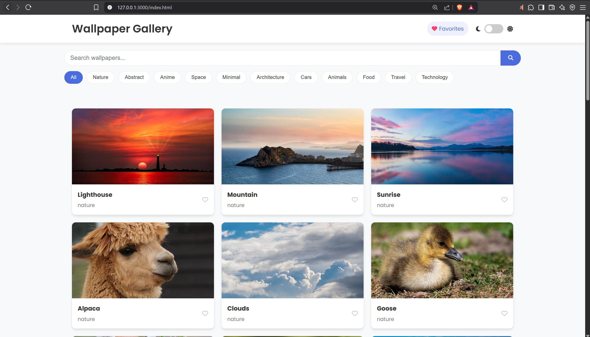
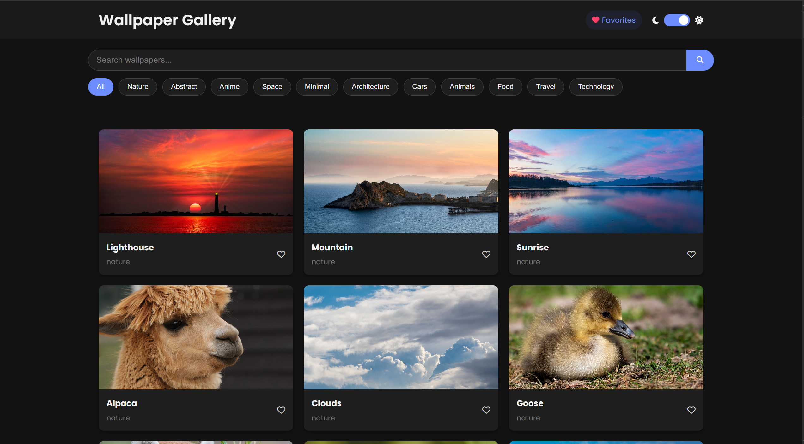
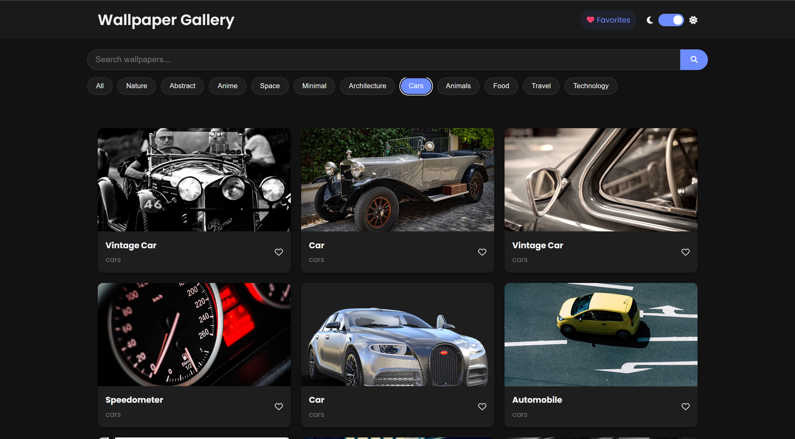
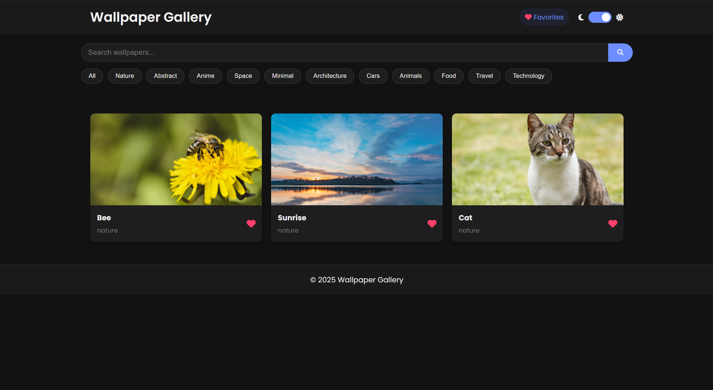
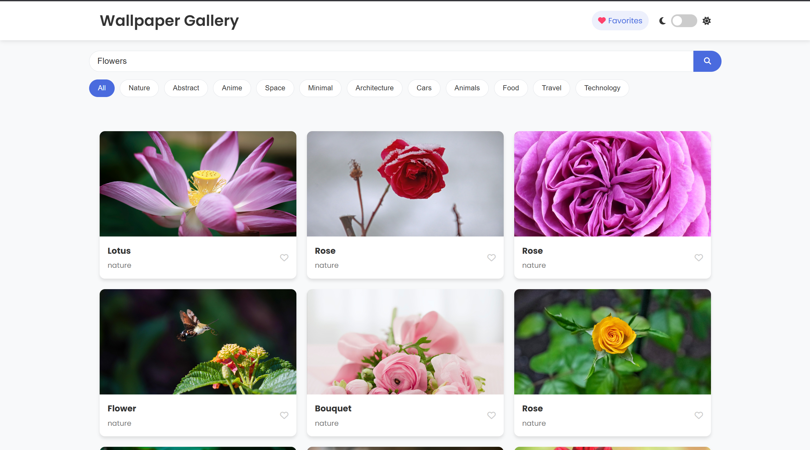
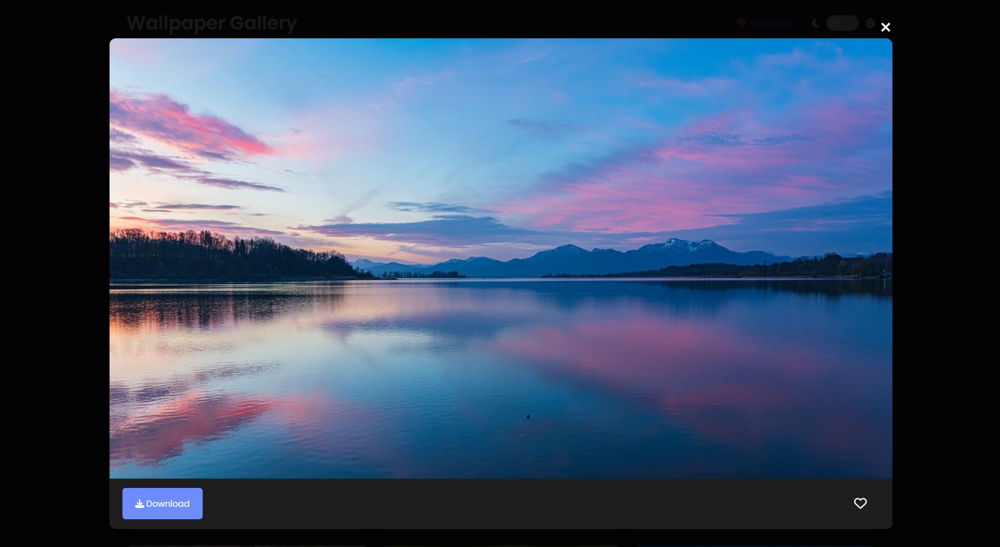

# 🖼️ Wallpaper Gallery

A beautiful and responsive **Wallpaper Gallery Webpage** built using **HTML, CSS, and JavaScript** with **Pixabay API integration**. This project showcases wallpapers across multiple categories and allows users to **view and download** high-quality images directly from the browser.

## 🚀 Features

- 📁 **Responsive Grid Layout** – Displays wallpapers in a clean and dynamic grid
- 🔍 **Search & Filter** – Users can search or filter wallpapers by category (Nature, Anime, Abstract, etc.)
- 🖼️ **Image Preview (Lightbox)** – Click to view a larger version of any wallpaper
- ⬇️ **Download Button** – Easily download wallpapers with a single click
- ❤️ **Favorites** – Users can "heart" wallpapers and save them as favorites (stored in localStorage)
- 🌗 **Dark Mode** – Toggle between light and dark themes for better visual comfort
- 🔄 **API Integration** – Fetches wallpapers from Pixabay's extensive image library

## 📂 Project Structure

```
/wallpaper-gallery
│
├── index.html       # Main HTML file
├── style.css        # Stylesheet
├── script.js        # JavaScript functionality with API integration
└── README.md        # Project documentation
```

## 🛠️ Technologies Used

- **HTML5** - Semantic structure
- **CSS3** - Flexbox/Grid layouts and responsive design
- **JavaScript** - Dynamic content and API interaction
- **Pixabay API** - For fetching high-quality wallpaper images
- **Local Storage API** - For storing user favorites and preferences
- **Fetch API** - For making HTTP requests to the Pixabay API
- **Font Awesome** - For icons
- **Google Fonts** - For typography

## ⚙️ API Setup

This application uses the **Pixabay API** to fetch wallpaper images. To use it:

1. Register for a free API key at [Pixabay API](https://pixabay.com/api/docs/)
2. Replace `YOUR_PIXABAY_API_KEY` in the script.js file with your actual API key:

```javascript
const PIXABAY_API_KEY = 'YOUR_PIXABAY_API_KEY'; // Replace with your actual key
```

The free tier of Pixabay API allows:
- 5,000 requests per hour
- No attribution required for images
- Access to over 2.7 million images

## ✅ How to Use

1. Clone or download this repository:
   ```
   git clone https://github.com/rohan0526/wallpaper-gallery.git
   ```

2. Set up your Pixabay API key as explained in the API Setup section.

3. Open `index.html` in any web browser to view the gallery.

4. Use the search bar to find specific wallpapers or click on category buttons to filter by theme.

## 💡 Future Improvements

- Add pagination or infinite scroll for larger wallpaper collections
- Implement user accounts to sync favorites across devices
- Add resolution filter options
- Create a backend to allow user uploads
- Add a fullscreen viewing mode
- Implement wallpaper tags for more specific filtering

## 📸 Preview

Here are some preview screenshots of the Wallpaper Gallery:

### Light Mode Home

*The main gallery view in light mode showing various nature wallpapers*

### Dark Mode Home

*The gallery view in dark mode with a selection of minimal wallpapers*

### Category Filter - Cars

*Filtering wallpapers by the Cars category*

### Favorites Collection

*User's saved favorite wallpapers*

### Search Results

*Search results for "Flowers"*

### Image Preview with Download

*Expanded view of a wallpaper with download option*

---

### Made with ❤️ for creative wallpaper lovers. 